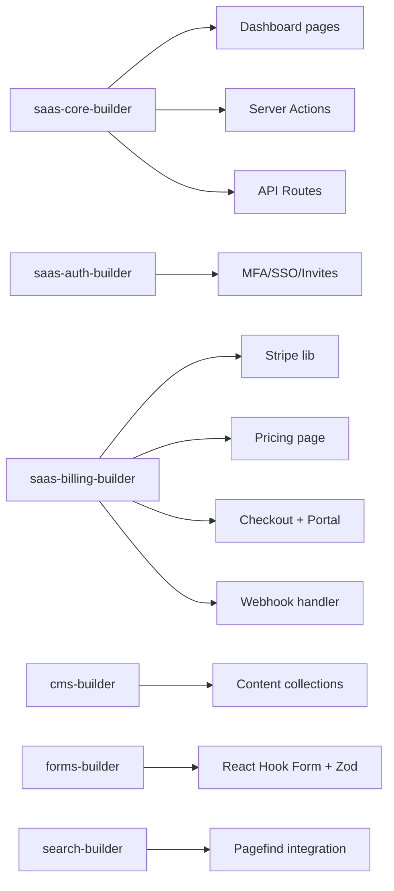

# `/ns-build` — Phase 4 : Build Logique Métier + API + Billing + CMS + Forms + Search

> **Objectif** : Implémentation complète — agents en parallèle, pipeline déterministe.

---

## Usage

```bash
/ns-build
# ou
pnpm ns:build
```

> **Prérequis** : Phases 1-3 terminées, `DESIGN-SPEC.md` validé.

---

## Agents Parallèles (Pipeline)



---

## Détail par Agent

### `saas-core-builder`

**Dashboard Layout `(app)`**

- Sidebar navigation responsive (mobile drawer)
- Header : user menu, org switcher, notifications
- Layout persistant avec `React.Suspense` boundaries

**Pages Protégées**

| Route              | Description                                                                |
| ------------------ | -------------------------------------------------------------------------- |
| `/tableau-de-bord` | Stats clés (MRR, users, churn, activity) — mock data v1                    |
| `/equipe`          | Liste membres, invitations, rôles (owner/admin/member), suppression        |
| `/reglages`        | Profil, notifications, sécurité (MFA, sessions), suppression compte        |
| `/facturation`     | Plan actuel, usage, historique factures, portail Stripe, upgrade/downgrade |
| `/cles-api`        | CRUD keys : création, rotation, révocation, scopes (read/write)            |

**Server Actions** (`app/(app)/actions/`)

- `createOrg`, `inviteMember`, `acceptInvitation`, `updateRole`, `removeMember`
- `createApiKey`, `revokeApiKey`, `updateProfile`, `updateNotifications`

**API Routes** (`app/[locale]/api/`)

- `/api/orgs` — CRUD organisations
- `/api/invitations` — Envoyer, annuler, lister
- `/api/api-keys` — CRUD keys + last_used tracking
- `/api/usage` — Métriques usage (pour billing usage-based v2)

**Realtime** (Supabase Realtime)

- Abonnements pour notifications, activité équipe
- `channel('org:{org_id}').on('postgres_changes', ...)`

---

### `saas-auth-builder` (Avancé)

**MFA TOTP**

- Setup : QR code + secret, verify, disable, recovery codes
- Pages : `/reglages/securite/mfa`

**SSO** (Configurable via env)

- Providers : GitHub, Google, Microsoft
- `ENABLE_SSO=true`, `SSO_PROVIDERS=google,github`

**Invitations**

- Email → token sécurisé → page acceptation → `org_members` insert
- Expiration 7 jours, resend possible

**Sessions**

- Liste appareils, révocation individuelle/toutes
- Device tracking (user agent, IP, last seen)

---

### `saas-billing-builder`

**`lib/stripe.ts`**

- Products, prices (création/sync depuis Stripe Dashboard)
- Checkout sessions (mode subscription)
- Portal sessions (gestion abonnement)
- Webhooks verification (signature check)

**Pricing Page** (`/(marketing)/pricing/page.tsx`)

- 3 tiers : Free, Pro, Enterprise
- Toggle mensuel/annuel (badge -20%)
- Feature comparison table
- CTA → `/api/billing/checkout`

**Checkout Flow**

- `POST /api/billing/checkout` → Stripe Checkout Session → redirect
- Success : `/facturation/succes` (sync DB + email)
- Cancel : `/facturation/annule` (message + retour pricing)

**Customer Portal**

- `POST /api/billing/portal` → Stripe Billing Portal Session → redirect

**Webhook Handler** (`workers/stripe-webhook.ts`)

```typescript
// Events gérés :
"checkout.session.completed"; // → create subscription record
"invoice.paid"; // → update subscription, email receipt
"customer.subscription.updated"; // → sync status, plan, period
"customer.subscription.deleted"; // → cancel, downgrade to free
"payment_method.attached"; // → update default payment method
```

**Migration DB**

- Table `subscriptions` + indexes sur `org_id`, `stripe_subscription_id`, `status`

---

### `cms-builder`

**Collections** (`content-collections.config.ts`)

- `posts` (blog) : title, slug, description, body (MDX), tags, heroImage, date, draft, order
- `pages` (marketing) : title, slug, description, body (MDX), heroImage, draft
- `components` (blocs réutilisables) : name, body (MDX), category
- `data` (JSON/YAML) : key, value, type

**Validation** : Zod schemas par collection

**MDX Components** : Registration dans `components/MDXComponents.tsx`

**Preview Mode** : Draft content visible via `?preview=true` + cookie

---

### `forms-builder`

**Stack** : React Hook Form + Zod resolvers

**Formulaires**

| Form           | Validation                      | Submit                              |
| -------------- | ------------------------------- | ----------------------------------- |
| ContactForm    | name, email, message + honeypot | Server Action → Brevo               |
| NewsletterForm | email + honeypot + rate limit   | Server Action → Brevo               |
| CheckoutForm   | Stripe Elements (card)          | Stripe JS → `/api/billing/checkout` |
| InviteForm     | email, role + org_id            | Server Action → invitation          |
| ApiKeyForm     | name, scopes, expires_at        | Server Action → createApiKey        |

**Notifications** : Toast (sonner) success/error

---

### `search-builder`

**Pagefind Integration**

- Build script : `pnpm pagefind` → `.next/server/app` → `public/pagefind/`
- UI Component : `components/ui/Search.tsx` (déjà créé)
- Index generation : automatique au build

**Search API Route** (fallback server-side)

- `GET /api/search?q=...&locale=...` → Pagefind index search

**Features**

- Highlighting termes recherchés
- Filtres : tags, date, type (post/page)
- Tri : pertinence, date, titre

---

## Gate Build

- ✓ `typecheck` — `tsc --noEmit` 0 erreurs
- ✓ `lint` — ESLint + Prettier 0 warnings
- ✓ `test` — Vitest unit tests (critical paths 100%)

---

## Commandes Utiles

```bash
# Dev continu (watch content + next)
pnpm dev

# Typecheck seul
pnpm typecheck

# Tests unitaires
pnpm test

# Build production (vérification complète)
pnpm build
```
