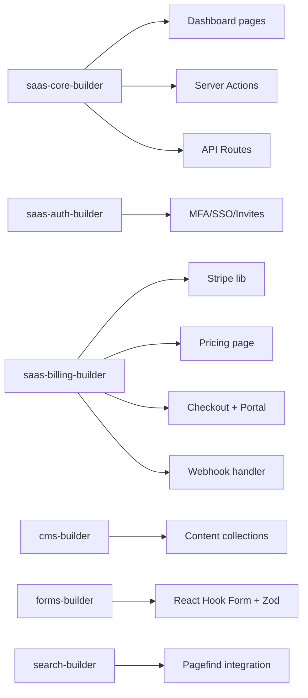

# `/ns-ship` — Pipeline Unifié SaaS-Zero (Next.js 14 + Supabase + Cloudflare)

> **Unique commande** pour aller de l'idée au SaaS déployé.
> Six phases, gates déterministes, agents parallèles, zéro décision humaine après le lancement.

---

## Usage

```bash
/ns-ship "SaaS de facturation pour freelances avec Stripe, équipe, API keys"
```

---

## Phase 1 — Discovery (15-30 min)

**Objectif** : Produire `SPEC.md` + `ARCHITECTURE-CHOICE.md` + `DESIGN-CHOICE.md` validés.

### Étapes

1. **Clarification produit** (agent `saas-project-compliance` mode discovery)
   - B2B vs B2C → détermine RLS, dashboard, billing
   - Design system → `ns-design-system` skill (palette, ambiance, élément signature — inspiré Linear/Vercel/Stripe/Framer ou Custom)
   - Motion tier → Minimal / Moderate / Bold
   - Features core → liste priorisée (MVP vs v2)

2. **Génération specs**
   - `SPEC.md` : vision, public, features MVP, non-fonctionnels, gates, deployment
   - `ARCHITECTURE-CHOICE.md` : stack, tables, env vars, pipeline
   - `DESIGN-CHOICE.md` : tokens, composants, motion, a11y

3. **Gate Discovery** : Validation humaine obligatoire (PR ou prompt)
   - `cat SPEC.md ARCHITECTURE-CHOICE.md DESIGN-CHOICE.md` → **Approuver / Modifier**

### Sortie

- `SPEC.md` ✓
- `ARCHITECTURE-CHOICE.md` ✓
- `DESIGN-CHOICE.md` ✓
- `DISCOVERY.md` (log complet)

---

## Phase 2 — Scaffold (5-10 min)

**Objectif** : Repo prêt à coder — structure, deps, Supabase, Cloudflare, env.

### Agents parallèles

| Agent               | Livrable                                                                                                                                                                                 |
| ------------------- | ---------------------------------------------------------------------------------------------------------------------------------------------------------------------------------------- |
| `saas-core-builder` | Routes Next.js 14, layout `(marketing)` + `(app)`, Supabase clients (browser/server/middleware), `lib/utils`, `lib/content`, content-collections config, next-intl i18n, middleware auth |
| `saas-auth-builder` | Tables Supabase (orgs, members, teams, invitations), RLS policies, migrations, Auth UI pages (login, register, forgot, reset, magic-link, 2FA), middleware protected routes              |

### Scripts exécutés

```bash
pnpm install
pnpm content:build
pnpm supabase:gen:types
pnpm typecheck && pnpm lint
```

### Gate Scaffold

- `typecheck` ✓
- `lint` ✓
- Structure repo conforme `ARCHITECTURE-CHOICE.md`

---

## Phase 3 — Design (15-30 min)

**Objectif** : Design system complet + composants + Storybook + baselines visuels.

### Agents

- `design-architect` + `saas-ui-builder` (séquentiel)

### Livrables

- `DESIGN-SPEC.md` : tokens (colors, spacing, radii, shadows, fonts), semantic aliases, dark mode
- `components/ui/*` : primitives shadcn (Button, Input, Card, Dialog, Table, Form, Select, Toast, Tooltip, Avatar, Badge, Tabs, Accordion, Dropdown, Sheet, Popover, HoverCard, ContextMenu, Menubar, NavigationMenu, Pagination, Progress, Slider, Switch, Checkbox, RadioGroup, Label, Separator, ScrollArea, Resizable, Command, Calendar, DatePicker, Chart, Carousel, Toast, Sonner)
- `components/forms/*` : ContactForm, NewsletterForm, CheckoutForm, InviteForm, ApiKeyForm
- `components/sections/*` : Hero, Features, Pricing, Testimonials, FAQ, CTA, Footer, Navbar
- `components/MDXComponents.tsx` : composants CMS (Hero, FeatureGrid, PricingTable, TestimonialCarousel, FAQ, CTA)
- `.storybook/*` : config, stories pour chaque composant
- `tests/visual/baselines/*` : captures Playwright pour regression

### Gate Design

- Storybook build ✓
- Visual baselines capturées ✓
- Tokens utilisés partout (grep pas de valeurs hardcodées)

---

## Phase 4 — Build (30-60 min)

**Objectif** : Logique métier, API, billing, CMS, forms, search — agents en parallèle.

### Agents parallèles (pipeline)



### Détail par agent

#### `saas-core-builder`

- Dashboard layout `(app)` : sidebar, header, org switcher, user menu
- Pages : `/tableau-de-bord` (stats), `/equipe` (membres + invitations), `/reglages` (profil, sécurité, notifications, suppression), `/facturation` (plan, usage, factures, portal), `/cles-api` (CRUD keys)
- Server Actions : `createOrg`, `inviteMember`, `acceptInvitation`, `updateRole`, `removeMember`, `createApiKey`, `revokeApiKey`
- API Routes : `/api/orgs`, `/api/invitations`, `/api/api-keys`, `/api/usage`
- Realtime : abonnements Supabase pour notifications, activité équipe

#### `saas-auth-builder` (avancé)

- MFA TOTP : setup, verify, disable, recovery codes
- SSO : GitHub, Google, Microsoft (configurable via env)
- Invitations : email → token → accept → org_member insert
- Sessions : liste, révocation, device tracking

#### `saas-billing-builder`

- `lib/stripe.ts` : products, prices, checkout sessions, portal sessions, webhooks verification
- Pricing page : 3 tiers, monthly/yearly toggle, feature comparison
- Checkout : `/api/billing/checkout` → Stripe Checkout Session → redirect
- Success/Cancel pages : `/facturation/succes`, `/facturation/annule`
- Customer Portal : `/api/billing/portal` → Stripe Billing Portal → redirect
- Webhook handler : `workers/stripe-webhook.ts` (Cloudflare Worker)
  - `checkout.session.completed` → create subscription record
  - `invoice.paid` → update subscription, email receipt
  - `customer.subscription.updated` → sync status, plan, period
  - `customer.subscription.deleted` → cancel, downgrade to free
  - `payment_method.attached` → update default payment method
- Migration : `subscriptions` table + indexes

#### `cms-builder`

- Collections : `posts`, `pages`, `components`, `data` (JSON/YAML)
- Fields validation Zod
- MDX components registration
- Preview mode (draft content)

#### `forms-builder`

- React Hook Form + Zod resolvers
- Server Actions pour soumission
- honeypot + rate limit
- Toast notifications (sonner)

#### `search-builder`

- Pagefind integration : build script, UI component, index generation
- Search API route (fallback server-side)
- Highlighting, filters, sorts

### Gate Build

- `typecheck` ✓
- `lint` ✓
- `test` (unit) ✓

---

## Phase 5 — Verify (10-20 min)

**Objectif** : 13 gates déterministes — zéro jugement subjectif.

### Exécution

```bash
/ns-verify
# ou
pnpm gates:all
```

### 13 Gates (scripts dans `package.json`)

| #   | Gate                 | Commande                                               | Critère                          |
| --- | -------------------- | ------------------------------------------------------ | -------------------------------- |
| 1   | `gate:typecheck`     | `tsc --noEmit`                                         | 0 erreurs strict                 |
| 2   | `gate:lint`          | `next lint --max-warnings=0`                           | 0 warnings                       |
| 3   | `gate:test`          | `vitest run --coverage`                                | 100% critical paths              |
| 4   | `gate:e2e`           | `playwright test`                                      | Auth, Billing, Core journey pass |
| 5   | `gate:visual`        | `playwright test --config=playwright.visual.config.ts` | 0 régressions vs baselines       |
| 6   | `gate:lighthouse`    | `lighthouse-ci`                                        | ≥ 90 Perf/A11y/BP/SEO            |
| 7   | `gate:bundle`        | `next build && analyze`                                | < budget gzipped                 |
| 8   | `gate:cwv`           | `web-vitals`                                           | LCP<2.5s, INP<200ms, CLS<0.1     |
| 9   | `gate:hydration`     | `next build` + check                                   | 0 mismatches                     |
| 10  | `gate:rls`           | `supabase test db`                                     | Toutes policies passent          |
| 11  | `gate:security`      | `npm audit --audit-level=high` + `codeql`              | 0 critical/high                  |
| 12  | `gate:accessibility` | `axe-core`                                             | WCAG 2.1 AA                      |
| 13  | `gate:contracts`     | `pact` / OpenAPI                                       | Contracts match spec             |

### Gate Verify

- **Tous les 13 passent** = ✓
- **Un seul échoue** = ❌ stop, fix, re-run

---

## Phase 6 — Deploy (5 min)

**Objectif** : Production live avec migrations, webhooks, smoke tests.

### Étapes

1. **Supabase Migrations**

   ```bash
   supabase db push --project-ref $SUPABASE_PROD_REF
   ```

2. **Cloudflare Pages**

   ```bash
   wrangler pages deploy --project-name=$PROJECT --branch=main
   ```

3. **Stripe Webhooks** (auto via CLI ou dashboard)
   - Endpoint : `https://$PROJECT.pages.dev/api/webhooks/stripe`
   - Events : `checkout.session.completed`, `invoice.paid`, `customer.subscription.updated`, `customer.subscription.deleted`, `payment_method.attached`

4. **Brevo Webhooks**
   - Endpoint : `https://$PROJECT.pages.dev/api/webhooks/brevo`
   - Events : `delivered`, `opened`, `clicked`, `bounced`, `unsubscribed`

5. **Smoke Tests** (Playwright sur preview URL)
   - Home page loads
   - Auth flow works
   - Checkout initiates
   - Dashboard accessible

### Gate Deploy

- Smoke tests ✓
- Preview URL accessible ✓

---

## Fichiers du Pipeline

```
.claude/
├── commands/
│   ├── ns-ship.md          # CE FICHIER - pipeline principal (6 phases)
│   ├── ns-verify.sh        # Script 13 gates (Phase 5)
│   ├── ns-deploy.sh        # Deploy script (Phase 6)
│   ├── ns-discovery.md     # Phase 1 : Discovery & Specs
│   ├── ns-scaffold.md      # Phase 2 : Scaffold Repo & Infra
│   ├── ns-design.md        # Phase 3 : Design System
│   ├── ns-build.md         # Phase 4 : Build (parallel agents)
│   ├── ns-qa.md            # Phase 5 : Verify (13 gates)
│   └── ns-deploy.md        # Phase 6 : Deploy Production
├── agents/
│   ├── saas-core-builder.md
│   ├── saas-auth-builder.md
│   ├── saas-billing-builder.md
│   ├── saas-ui-builder.md
│   ├── saas-qa-e2e.md
│   ├── saas-project-compliance.md
│   ├── saas-perf-auditor.md
│   ├── design-architect.md
│   ├── cms-builder.md
│   ├── forms-builder.md
│   ├── search-builder.md
│   └── storybook-builder.md
└── skills/
    ├── ns-design-system.md (design non-générique, tokens, élément signature)
    ├── ns-landing.md · ns-auth.md · ns-organizations.md · ns-billing.md
    ├── ns-dashboard.md · ns-onboarding.md · ns-retention.md · ns-analytics.md
    ├── ns-admin.md · ns-quality-gates.md · ns-load-test.md · ns-sentry.md
    └── + skills contenu (ns-contentlayer, ns-forms, ns-pagefind, ns-next-intl, ...)
```

---

## Variables d'Environnement Requises

```bash
# Supabase
SUPABASE_URL=
SUPABASE_ANON_KEY=
SUPABASE_SERVICE_ROLE_KEY=
SUPABASE_DB_URL=

# Stripe
STRIPE_SECRET_KEY=
STRIPE_PUBLISHABLE_KEY=
STRIPE_WEBHOOK_SECRET=

# Brevo
BREVO_API_KEY=
BREVO_SENDER_EMAIL=
BREVO_SENDER_NAME=

# Cloudflare
CLOUDFLARE_ACCOUNT_ID=
CLOUDFLARE_API_TOKEN=

# Feature Flags
ENABLE_MFA=true
ENABLE_SSO=false
SSO_PROVIDERS=google,github
```

---

## Exemple Complet

```bash
# 1. Lancer le pipeline
/ns-ship "SaaS de gestion de projets pour agences : projets, tâches, équipe, facturation temps, client portal"

# 2. Phase 1 - Discovery (interactif)
#    → Questions : B2B, design=Linear, motion=Moderate, features=[projects, tasks, team, billing, clients]
#    → Génère SPEC.md, ARCHITECTURE-CHOICE.md, DESIGN-CHOICE.md
#    → Gate: validation humaine

# 3. Phase 2 - Scaffold (auto)
#    → Repo structuré, Supabase linké, types générés
#    → Gates: typecheck, lint

# 4. Phase 3 - Design (auto)
#    → Tokens Linear, composants, Storybook, baselines
#    → Gates: visual baselines

# 5. Phase 4 - Build (parallèle, 45 min)
#    → 6 agents en parallèle
#    → Gates: typecheck, lint, test

# 6. Phase 5 - Verify (auto)
#    → 13 gates déterministes
#    → Tous passent = ✓

# 7. Phase 6 - Deploy (auto)
#    → Migrations, Cloudflare, Stripe/Brevo webhooks, smoke tests
#    → SaaS live sur https://xxx.pages.dev

# Total: ~1-2h pour un SaaS complet MVP
```

---

## Règles Non-Négociables

1. **Une seule commande** : `/ns-ship` — pas de phases manuelles
2. **Gates déterministes** : scripts, pas jugement LLM
3. **Parallélisation max** : Phase 4 = 6 agents simultanés
4. **RLS 100%** : toute table = policy testée en CI
5. **Tokens only** : pas de valeurs hardcodées (grep CI)
6. **TypeScript strict** : zéro `any` en prod
7. **Env validated** : `npm run env:check` à chaque phase
8. **Rollback possible** : migrations réversibles, deploy preview avant prod

---

_Pipeline `ns-ship` v1.0 — SaaS-Zero (Next.js 14)_
